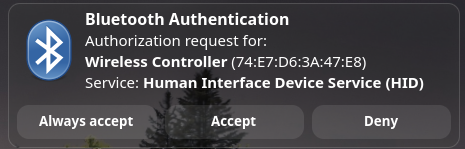

# DualShock 4 to Virtual PlayStation Controller Translator

A daemon for Linux that maps a physical DualShock 4 controller (connected via Bluetooth or USB) to a virtual DualShock 4 or DualSense controller (connected via virtual USB). It automatically hides the physical controller inputs to prevent double inputs in games, while supporting full LED and rumble passthrough.

It includes an IPC runtime control program (`ds4-ctl`) that allows users to change configuration (such as the virtual controller emulation type) at runtime without restarting the daemon.

## Features

- **Virtual Controller Emulation**: Uses `/dev/uhid` to expose a virtual USB DualShock 4 or DualSense controller to games, Steam, and Wine/Proton.
- **Persistent Configuration**: Emulation settings are saved to `/etc/ds4-translator.conf` at runtime. The setting persists across service restarts, system reboots, and controller reconnections.
- **Runtime Configuration (IPC)**:
  - Uses a Unix domain socket at `/run/ds4-translator.sock` (accessible by user-level programs) to communicate.
  - Includes a `ds4-ctl` utility to query status and set emulation types on the fly.
- **Physical Controller Hiding**:
  - Exclusively grabs `/dev/input/event*` nodes using `EVIOCGRAB`.
  - Sets `/dev/hidraw*` permissions of the physical controller to `000` while open, restoring them on exit.
- **Rumble & LED Passthrough**: Translates force-feedback rumble and lightbar colors from games back to the physical DualShock 4 controller.
- **Battery Status Passthrough**: Forwards the physical controller's real charge level and cable/charging state to the virtual device (translated to DualSense's status format when emulating one), instead of always reporting fully charged.
- **Bluetooth Support**: Parses both minimal USB and extended Bluetooth input reports from the physical DualShock 4, computing output report CRC32 checksums as required by the Sony Bluetooth HID specification.
- **Systemd Integration**: Includes a systemd service file to run the translator as a root-level service.

## Prerequisites

Ensure that the User-space HID (`uhid`) kernel module is loaded:
```bash
sudo modprobe uhid
```

## Installation

### Option 1: Download a release

Grabs the latest prebuilt release tarball (no compiler needed) and installs it:
```bash
curl -s https://api.github.com/repos/Billones142/ds4-translator/releases/latest \
  | grep browser_download_url | cut -d '"' -f4 | xargs curl -LO
tar xzf ds4-translator-*.tar.gz
cd ds4-translator-*/
sudo make install
```

### Option 2: Clone and build from source
```bash
git clone https://github.com/Billones142/ds4-translator.git
cd ds4-translator
make
sudo make install
```

By default, the service starts emulating a virtual **DualShock 4** controller.

## Runtime Configuration Utility (`ds4-ctl`)

Users can query the status and change the emulated virtual controller type dynamically at runtime using the `ds4-ctl` tool (which does not require root privileges).

### Query Daemon Status
```bash
ds4-ctl status
```
Example Output:
```text
Physical Controller: /dev/hidraw1
Connection Type: Bluetooth
Virtual Emulation: DualShock 4
Device Open by Host: Yes
```

### Change Virtual Controller Type dynamically
- Switch to emulating a **DualSense** controller:
  ```bash
  ds4-ctl set-type dualsense
  ```
- Switch to emulating a **DualShock 4** controller:
  ```bash
  ds4-ctl set-type ds4
  ```

## Uninstalling

To disable the service and remove all installed files:
```bash
sudo make uninstall
```

## Known Issues

- **Standalone virtual controller not detected/responsive in some Wine/Proton games**: The primary use case — a physical DualShock 4 passed through to a virtual device — has been verified working correctly. The standalone virtual controller (created via `ds4-ctl create-virtual`/`ds4-ctl virtual`, with no physical hardware behind it) has been observed failing to receive input in at least one tested Wine/Proton title, despite extensive verification that input is delivered correctly at every layer this project controls: the HID report descriptor is byte-for-byte identical to real hardware, raw button/axis state reaches Wine's DirectInput layer correctly (confirmed via `WINEDEBUG=+dinput` traces), and the virtual device streams a continuous report heartbeat matching real hardware's idle behavior. The root cause hasn't been identified — it likely sits in the game's own higher-level controller-recognition logic rather than in this daemon, but that's unconfirmed. Treat standalone/no-hardware emulation as best-effort for now rather than a guaranteed-working feature.
- **"Bluetooth Authentication" popup when connecting via Bluetooth**: Only affects controllers paired over Bluetooth (not USB). Changing the emulation type (`ds4-ctl set-type ...`) releases and re-scans the physical controller, which briefly drops and re-establishes its Bluetooth HID connection — BlueZ can prompt for service authorization on that reconnect even for an already-paired, already-trusted device.

  

  If it appears, choose **Always Accept**. Accepting/rejecting doesn't affect the daemon's own translation (it's a BlueZ-level gate on the connection, unrelated to the kernel HID driver), so it's safe to dismiss either way, but accepting keeps the prompt from repeating.

## Technical Details

- **Official Driver Reference**: Wire protocol mapping is based on `hid-playstation.c` from the Linux kernel.
- **IPC Architecture**: Single-threaded non-blocking poll loop manages physical input reports, uhid events, and UDS IPC configuration clients concurrently. This keeps the daemon responsive to configuration commands even when no physical controller is connected.
- **Grabbing & Hiding**: By grabbing the event nodes and modifying the permissions of the `hidraw` node, the physical controller is completely hidden from user-space programs (preventing double inputs) while allowing the daemon (running as root) to continue reading raw inputs and writing output reports.
- **CRC32 Algorithm**: Implementation of the custom IEEE 802.3 CRC32 algorithm used to authenticate PlayStation Bluetooth output reports.
